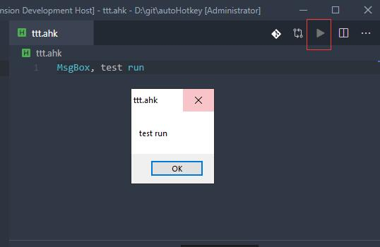

# vscode-autohotkey-Plus

> Base of [vscode-autohotkey](https://github.com/stef-levesque/vscode-autohotkey)
> 
> Welcome to contribute in [repository](https://github.com/cweijan/vscode-autohotkey)
>
> You can see changes in the [changelog](/CHANGELOG.md)

AutoHotKey language support for VS Code
* Code assistant
* Code and Method symbol
* Find definition
* Run Script
* Code format (Mayby unsuited for you code)

## Run Script
1. Click run button
2. Press F9

## Method Symbol
1. Detech source method as symbol
2. You can add a comment to the method using a semicolon on the previous line of the method

## Code Symbol

1. You can add two semicolon to comment code block

## Goto Definition

1. Press ctrl and move the mouse coordinates to the calling code 
