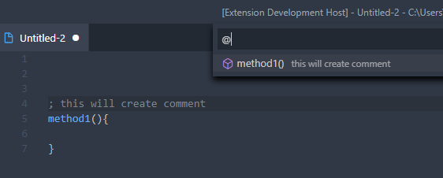
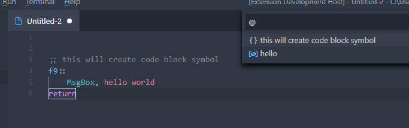
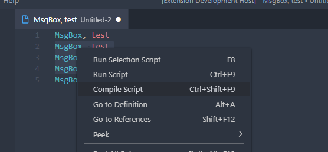

# VSCode-Autohotkey-Plus

AutoHotKey language support for VSCode
- [vscode-autohotkey-Plus](#vscode-autohotkey-plus)
  - [Start](#start)
  - [Debug](#debug)
  - [Language Features](#language-features)
  - [Context Menu](#context-menu)
  - [Setting](#setting)
  - [Credits](#credits)

## Start

1. The author has not learned the principles of compilation, so parser can only provide limited support, please understand this.
2. If you like this this extension, consider [buying me a coffee](https://www.buymeacoffee.com/cweijan). Thank you!

Install  [vscode-autohotkey-plus](https://marketplace.visualstudio.com/items?itemName=cweijan.vscode-autohotkey-plus) from vscode marketplace.

## Debug

**Features:**
1. Click run button or press F9.
2. Support breakpoint、stacktrace、variable
4. **Output Message**: Recommend using `OutputDebug` command instead MsgBox when debug.
4. **Evalute**: Set and get variable in debug evaluter.

This extension provides basic debugging functions. If you need more debugging functions(Like **conditional breakpoint**), install additional extension [vscode-autohotkey-debug](https://marketplace.visualstudio.com/items?itemName=zero-plusplus.vscode-autohotkey-debug).

## Language Features

This extension provides basic programming language support for autohotkey:
- Method Symbol: 
- Goto Definition: param, variable, method(**press ctrl then click**)
- Find References: Find method references(**shift+f12**).
- Code Format(**Shift+Alt+F**)
- Hover tip: Move mouse to method call or command. 
- Code Symbol: Add two semicolon to comment code block. 
- IntelliSense

## Context Menu

Support below function: 

## Setting

OpenSetting -> extensions -> Ahk Plus

## Credits
- [vscode-autohotkey](https://github.com/stef-levesque/vscode-autohotkey)
