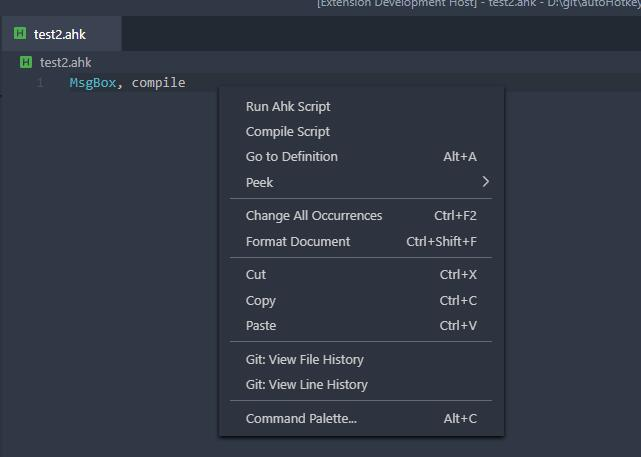
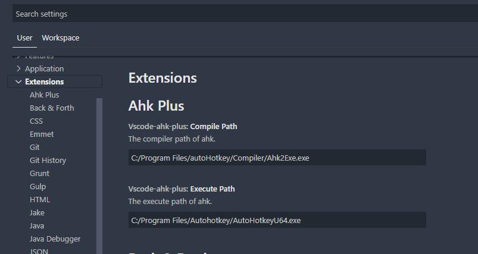

# vscode-autohotkey-Plus

> Project site: [vscode-autohotkey-plus](https://github.com/cweijan/vscode-autohotkey)
>
> View the changes in the [changelog](/CHANGELOG.md)

AutoHotKey language support for VS Code
- [vscode-autohotkey-Plus](#vscode-autohotkey-plus)
  - [Debug](#debug)
  - [Language Features](#language-features)
    - [Method Symbol](#method-symbol)
    - [Goto Definition](#goto-definition)
    - [Find References](#find-references)
    - [Code Symbol](#code-symbol)
    - [Hover Tip](#hover-tip)
    - [Code Format](#code-format)
  - [Context Menu](#context-menu)
  - [Setting](#setting)
  - [RoadMap](#roadmap)
  - [Credits](#credits)

## Debug
1. Click run button or press f9
2. Support breakpoint、stacktrace、variable

**Features:**
1. **Output Message**: you can using `OutputDebug` command instead MsgBox.

2. **Evalute**: Set and get variable in debug evaluter.

## Language Features

### Method Symbol
1. Detech source method as symbol
2. You can add a comment to the method using a semicolon on the previous line of the method

### Goto Definition

Usage: Press ctrl and move the mouse coordinates to the calling code.

### Find References

Usage: Move coordinates to method, then:
- Right click then click find all references.
- Or press `shift+f12`.

### Code Symbol

Usage: Add two semicolon to comment code block

### Hover Tip

Usage: Move mouse to method call or command.

### Code Format
Usage:
- Right click then click format document.
- Or press `Shift+Alt+F`.

- **Formatter follows my coding habits, so it may not unsuited for you**.

## Context Menu
Usage: Right click, then:
- **Run**: Run script without debug.
- **Compile**: Compile script in same directory.

## Setting

OpenSetting -> extensions -> Ahk Plus

## Credits
- [vscode-autohotkey](https://github.com/stef-levesque/vscode-autohotkey)
