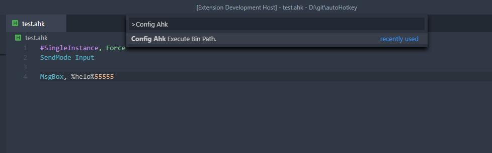

# vscode-autohotkey-Plus

> Base of [vscode-autohotkey](https://github.com/stef-levesque/vscode-autohotkey)
> 
> Welcome to contribute in [repository](https://github.com/cweijan/vscode-autohotkey)
>
> You can see changes in the [changelog](/CHANGELOG.md)

AutoHotKey language support for VS Code
* Code Assistant
* [Code Symbol](#CodeSymbol) and [Method Symbol](#MethodSymbol)
* [Goto Definition](#GotoDefinition)
* Run/[Debug](#Debug)/Compile Script
* [Code Format](#CodeFormat)

## Debug
1. Click run button or press f9
2. Support breakpoint、stacktrace、variable

**Change Default Execute Path:**
1. The default is C:\\Program Files\\Autohotkey\\AutoHotkeyU64.exe
2. Press "Ctrl+Shift+P" to open command palette.
3. Input "Config Ahk" to select config command.

## MethodSymbol
1. Detech source method as symbol
2. You can add a comment to the method using a semicolon on the previous line of the method

## CodeSymbol

1. You can add two semicolon to comment code block

## GotoDefinition

1. Press ctrl and move the mouse coordinates to the calling code 

## CodeFormat
1. Right click then click format document.
- **Formatter follows my coding habits, so it may not unsuited for you**.
