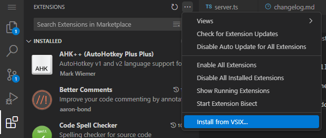
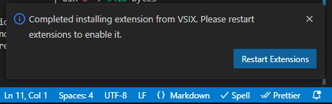
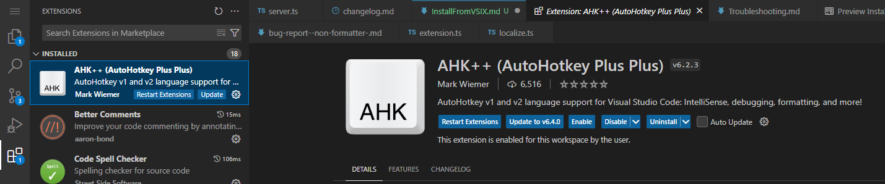

# Install from VSIX

Some IDEs support installing extensions directly from your local machine. This can be faster and more private than downloading from a registry.

All releases are published to https://github.com/mark-wiemer-org/ahkpp/releases as vsix files.

Once you have the file downloaded, you can open your IDE, go to the extensions view, and select "Install from VSIX..."

Once installed, you should see an info message prompting you to restart extensions:

Finally, you can manage which version of an extension you have installed from the extensions view:

