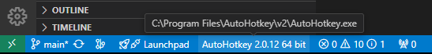
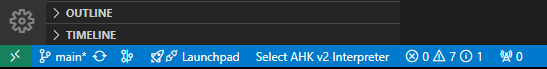

# Troubleshooting guide

If AHK++ isn't behaving as you expect, here are some things you can try.

## AHK v2: Validate your interpreter

For AHK v2, the language server may not behave correctly if it fails to identify a valid path to an interpreter like `AutoHotkey.exe`. The status bar at the bottom left of your IDE should show the current interpreter or an option to "Select AHK v2 Interpreter".

> Currently, the "Select AHK v2 Interpreter" command does not work, ref [#571](https://github.com/mark-wiemer-org/ahkpp/issues/571).
> To ensure the extension fully recognizes your interpreter, try to run (not debug) an AHK v2 script. If you get a "... does not exist" error message, the corresponding quick pick will work.

> Currently, AHK++ does not support the Windows Store edition of AHK v2, but there are plans to support it by the end of 2024, ref [#496](https://github.com/mark-wiemer-org/ahkpp/issues/496).

Interpreter found:

Interpreter not found:

## Restart extensions

Some settings changes only take effect after restart. Other issues may arise that are mitigated with a restart.

To restart all extensions, press F1 to open the command palette and enter "Developer: Restart Extension Host". Extensions should restart within a few seconds.

If you're able to consistently reproduce the issue, please [open a bug](https://github.com/mark-wiemer-org/ahkpp/issues/new/choose).

## Install specific version of AHK++

If a recent release is causing issues, you can revert to a previous version via your IDE's extensions view.

1. Select AHK++
1. Near "uninstall", click the small caret (down arrow)
1. Select "Install Specific Version..."
1. A quick pick will open with all versions, select whichever one you like.
    > Note that changing the major version (e.g. from 6.x to 5.x) will likely result in some issues. Refer to [changelog.md](../changelog.md) for details.

The current installed version of AHK++ is also shown to the right of the extension name for clarity, outlined above in red.

If the issue goes away with the older version of AHK++, please [open a bug](https://github.com/mark-wiemer-org/ahkpp/issues/new/choose).

## Advanced troubleshooting

These steps shouldn't be necessary for most issues, and may be difficult to execute. Feel free to open an issue without trying these :)

### Debug logs

Using Ctrl+Shift+U to open the output view, you can select either of the AHK++ channels to see all debug logs. You're welcome to map these logs to `Output.debug` and `console.log` calls in the source code. Please include your findings if you [open a bug](https://github.com/mark-wiemer-org/ahkpp/issues/new/choose).
