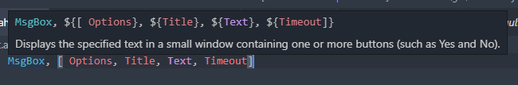
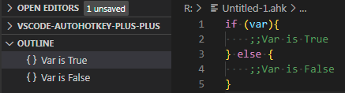
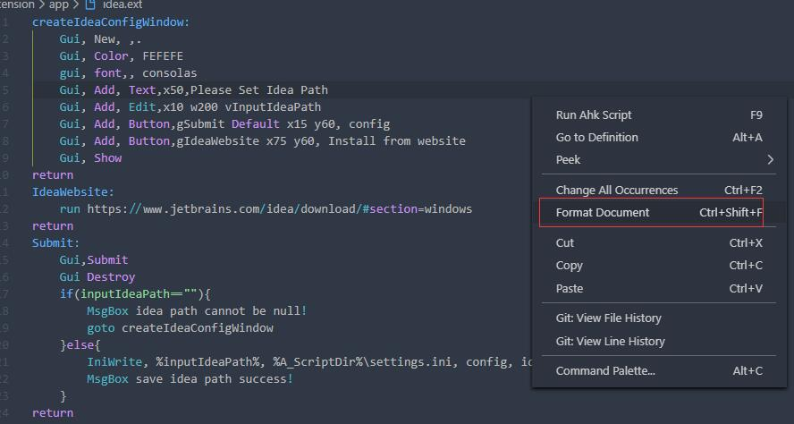

# AutoHotkey Plus Plus (AHK++)

AutoHotkey Plus Plus (AHK++) provides AutoHotkey language support for VS Code. For AHK v1, this includes:

-   IntelliSense
-   syntax highlighting
-   debug support
-   formatting
-   quick help
-   ...and more!

## Install

Install from VS Code or install from [VS Code Marketplace](https://marketplace.visualstudio.com/items?itemName=mark-wiemer.vscode-autohotkey-plus-plus).

## AHK v2 full support in pre-release!

AutoHotkey v2 support has been a [long-requested feature](https://github.com/mark-wiemer-org/ahkpp/issues/96), and v5.0.0 supports many key features. The latest [🧪 pre-release version](https://code.visualstudio.com/updates/v1_63#_pre-release-extensions), v5.1.0, adds full v2 support!

Supported features include:

-   Running and debugging v1 and v2 scripts without changing settings
-   Full syntax highlighting for v2 scripts
-   "Open help" (Ctrl + F1) opens language-specific help (and includes your text selection!)
-   Unique icons for v1 (blue) and v2 (green)
-   Rich IntelliSense support with snippets and hover text (🧪 pre-release only)
-   Formatting files (🧪 pre-release only)

For known issues, see [the changelog](./Changelog.md)

Please [🐛 report any issues](https://github.com/mark-wiemer-org/ahkpp/issues/new/choose), it helps bring full v2 support to the release version faster 🧑‍💻

💚 Special thanks to [thqby](https://github.com/thqby), as this would not have been possible without thqby's open-source [AutoHotkey v2 Language Support](https://marketplace.visualstudio.com/items?itemName=thqby.vscode-autohotkey2-lsp)!

## Why AutoHotkey Plus Plus?

AutoHotkey Plus Plus is one of many extensions that offer VS Code language support. So why should you use this one?

-   **Supports both v1 and v2**: AHK++ supports both AHK v1 and v2, making it the only extension to support both major versions of AutoHotkey!
-   **Actively maintained**: Any issues encountered while using this extension can be reported and fixed. With other extensions, anything that's broken will stay broken forever. You can report any issues with AHK++ (and view all issues) through the [issue tracker](https://github.com/mark-wiemer-org/ahkpp/issues).
-   **IntelliSense**: Smart code completion, syntax highlighting, code navigation, and more.
-   **Debug support**: Run and debug AHK scripts from VS Code.
-   **New features**: Another benefit to active maintenance is that AHK++ can add new features as users request them. For example, quick help, formatter directives, and custom new file templates were all added based on user feedback!

## Commands

With AHK++, you can compile, debug, and run your scripts with keyboard shortcuts. You can also run a selection as a standalone script.

-   Compile: `Ctrl + Shift + F9`
-   Debug: `Ctrl + Alt + F9`
-   Open help: `Ctrl + F1`
-   Run: `Ctrl + F9`
-   Run selection: `Ctrl + F8`

## Debug

> There are some [known issues with the debugger](https://github.com/mark-wiemer-org/ahkpp/issues?q=is%3Aopen+is%3Aissue+label%3Adebugger). If you need an advanced setup, we recommend [zero-plusplus.vscode-autohotkey-debug](https://marketplace.visualstudio.com/items?itemName=zero-plusplus.vscode-autohotkey-debug) for now. Please [open an issue](https://github.com/mark-wiemer-org/ahkpp/issues/new/choose) if the built-in debugger does not support your needs. As `zero-plusplus.vscode-autohotkey-debug` is [closed-source](https://github.com/zero-plusplus/vscode-autohotkey-debug/discussions/332), we will be working to introduce advanced debugger features to ensure an open-source, collaborative, complete extension is available to the AHK community 🙂

1. Click the debug button in the editor title menu (at the top right of the editor) or press `Ctrl + Alt + F9`.
2. The debugger supports breakpoints, stack tracing, and variable watching

    

### Debug features

1. **Output message**: You can use `OutputDebug` command instead of `MsgBox` to log values.

    

2. **Evaluate**: Set and get variable values through the debug console.

    

This extension provides basic debugging functions. If you need more debugging functions (such as conditional breakpoints), you can add an additional extension: [Install vscode-autohotkey-debug](https://marketplace.visualstudio.com/items?itemName=zero-plusplus.vscode-autohotkey-debug).

## Language Features

### IntelliSense

Supports IntelliSense for variables and functions.

### Function symbol

1. You can add a comment to the function using a semicolon on the line above the function declaration

### Go to definition

1. Supports navigation to symbol definition.
2. Usage: Ctrl-click on the symbol to navigate to its definition.


### Find symbol references

Select a symbol, then:

-   Right-click and select `Find All References`.
-   Or press `Shift + F12`.

### Hover tip

Usage: Hover over symbol to see IntelliSense documentation.



### Outline

Assign name to block of code via double semicolon comment `;;Name` and go to it from outline.



### Folding

Custom folding regions:

```autohotkey
;region
MsgBox % "Collapse me!"
;endregion

; Block comments with regions
/* ;region
Collapse me!
*/ ;endregion
```

### Code format

Supports standard VS Code formatting with a few options.



#### Formatter Directives

Formatter directives instruct the formatter to behave a certain way on sections of code.

1. `FormatBlockComment`:

    ```autohotkey
    ;@AHK++FormatBlockCommentOn
    /*
    ;All text inside block comment will be formatted like regular code.
    */
    ;@AHK++FormatBlockCommentOff
    ```

2. `AlignAssignment`:

    ```autohotkey
    ;@AHK++AlignAssignmentOn
    a          = 5 ; number five
    str        = legacy text = with equal symbol
    inputFile := "movie.mkv"
    abc       := "abc" ; string
    abc       := a + b
    ;@AHK++AlignAssignmentOff
    ```

## Credits

This extension relies heavily on open-source code. A huge thank you to all these open-source participants who made the extension what it is today!

-   [AutoHotkey Plus by cweijan](https://marketplace.visualstudio.com/items?itemName=cweijan.vscode-autohotkey-plus): AHK++ is a fork of AutoHotkey Plus by cweijan (Weijan Chen)
-   [Contributions to AHK++ by kyklish](https://github.com/mark-wiemer-org/ahkpp/commits/main?author=kyklish): Greatly improved formatting and snippets by both fixing bugs and adding features
-   [AutoHotkey v2 Language Support by thqby](https://marketplace.visualstudio.com/items?itemName=thqby.vscode-autohotkey2-lsp): The source of the v2 grammar and other great contributions
-   [Lexikos/vscode-auto-select](https://github.com/Lexikos/vscode-auto-select): The core code for automatically switching AHK versions
-   [AutoHotkey by stef-levesque](https://marketplace.visualstudio.com/items?itemName=slevesque.vscode-autohotkey): AutoHotkey Plus is a fork of stef-levesque's original AutoHotkey extension, which provided the original grammar and snippets for AHK

## Links

-   [GitHub](https://github.com/mark-wiemer-org/ahkpp): View code, file bugs, and join discussions
-   [Reviews](https://marketplace.visualstudio.com/items?itemName=mark-wiemer.vscode-autohotkey-plus-plus&ssr=false#review-details): Help others discover AHK++ by leaving a review
